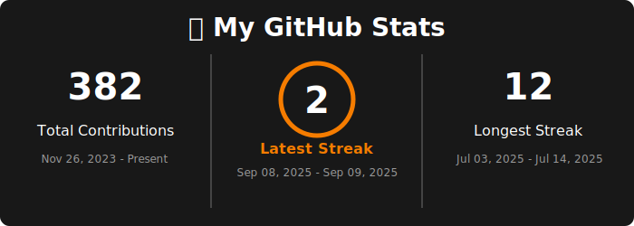

# 🔥 My GitHub Stats

[](https://www.python.org/)
[](https://github.com/panditpooja/github_stats/actions)
[](https://github.com/panditpooja/github_stats/commits/main)

This repository contains a workflow and Python script to generate a custom GitHub stats badge (SVG image) that displays your total contributions, current streak, and longest streak.

The badge updates automatically every day using GitHub Actions and can be embedded directly into your profile README or any other markdown file.

---

## 🚀 Features
- 📊 Fetches contribution data from the GitHub GraphQL API
- 🔥 Calculates:
  - Total contributions since account creation
  - Current contribution streak
  - Longest contribution streak
- 🖌️ Renders this information into a **visually appealing SVG badge**
- 🤖 Automates daily updates with a GitHub Actions workflow

---

## 🌟 Live Example Badge



---

<details>
<summary>📊 Example Badges (Click to Expand)</summary>

🔥 **My GitHub Stats**
- **Total Contributions**: 303
- **Current Streak**: 11 days (Date Range)
- **Longest Streak**: 11 days (Date Range)


🔥 **Updated Stats**
- **Total Contributions**: 306
- **Current Streak**: 12 days (Date Range)
- **Longest Streak**: 12 days (Date Range)


🔥 **New Streak Stats**
- **Total Contributions**: 314
- **Current Streak**: 1 day (Date Range)
- **Longest Streak**: 12 days (Date Range)


</details>

---

<details>
<summary>🛠️ Setup Instructions (Click to Expand)</summary>

### 1️⃣ Prerequisites
- A GitHub account
- Python 3 installed locally (for manual testing)
- A Personal Access Token with `repo` and `read:user` permissions

### 2️⃣ Repository Setup
1. **Clone this repository** or create a new one.
2. Add the following files:
   - `generate_stats.py` in the root
   - `.github/workflows/update-github-stats.yml`
   - `assets/github-stats.svg` (this will be generated)
   - `github_stats_workflow_documentation.pdf` for reference

### 3️⃣ Configure Secrets
1. Go to your repository on GitHub.
2. Navigate to **Settings > Secrets and variables > Actions**.
3. Add a new repository secret:
   - **Name**: `GH_TOKEN`
   - **Value**: Your personal access token

### 4️⃣ Update Python Script
Edit `generate_stats.py` and set your GitHub username:
```python
USERNAME = "your-github-username"
```

### 5️⃣ Commit and Push
Commit all files to your repository and push changes to GitHub.

### 6️⃣ Trigger Workflow
- The workflow runs automatically every day.
- You can also trigger it manually from the **Actions** tab.

</details>

---

## 📤 Output
The workflow generates an SVG badge at `assets/github-stats.svg`.  

Embed it in your README.md like this:  
```markdown

```

---

<details>
<summary>📁 Project Structure (Click to Expand)</summary>

```
.github/
└── workflows/
    └── update-github-stats.yml    # GitHub Actions workflow

assets/
└── github-stats.svg               # Generated SVG badge

generate_stats.py                   # Python script to fetch and render stats
github_stats_workflow_documentation.pdf  # Project documentation
README.md                            # Project overview and instructions
```

</details>

---

## 🙌 Acknowledgements
- GitHub GraphQL API
- [svgwrite](https://pypi.org/project/svgwrite/) for SVG generation
- GitHub Actions for automation

---

## ✍️ Author

**Pooja Pandit**  
Master’s Student in Information Science (Machine Learning)  
The University of Arizona  

[](https://github.com/panditpooja)
[](https://www.linkedin.com/in/pooja-pandit-177978135/)

---
