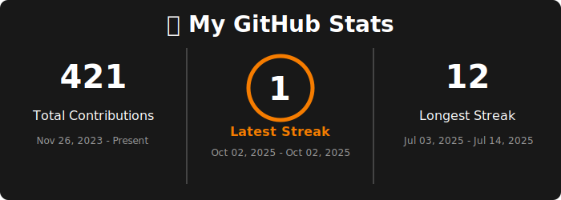

# 🔥 My GitHub Stats

[](https://www.python.org/)
[](https://github.com/panditpooja/github_stats/actions)
[](https://github.com/panditpooja/github_stats/commits/main)

This repository contains a workflow and Python script to generate a custom GitHub stats badge (SVG image) that displays your total contributions, current streak, and longest streak.

The badge updates automatically every day using GitHub Actions and can be embedded directly into your profile README or any other markdown file.

---

## 🚀 Features
- Fetches contribution data from the GitHub GraphQL API.
- Calculates:
  - Total contributions since account creation
  - Current contribution streak
  - Longest contribution streak
- Renders this information into a visually appealing SVG badge.
- Automates daily updates with a GitHub Actions workflow.

---

## 📁 Project Structure
```
.github/
└── workflows/
    └── update-github-stats.yml    # GitHub Actions workflow

assets/
└── github-stats.svg               # Generated SVG badge

generate_stats.py                   # Python script to fetch and render stats
github_stats_workflow_documentation.pdf  # Project documentation
README.md                            # Project overview and instructions
```

---

## 🛠️ Setup Instructions

### 1️⃣ Prerequisites
- A GitHub account
- Python 3 installed locally (if you want to test the script manually)
- A Personal Access Token with `repo` and `read:user` permissions

### 2️⃣ Repository Setup
1. **Clone this repository** or create a new one.
2. Add the following files:
   - `generate_stats.py` in the root
   - `.github/workflows/update-github-stats.yml`
   - `assets/github-stats.svg` (this will be generated)
   - `github_stats_workflow_documentation.pdf` for reference

### 3️⃣ Configure Secrets
1. Go to your repository on GitHub.
2. Navigate to **Settings > Secrets and variables > Actions**.
3. Add a new repository secret:
   - **Name**: `GH_TOKEN`
   - **Value**: Your personal access token

### 4️⃣ Update Python Script
Edit `generate_stats.py` and set your GitHub username:
```python
USERNAME = "your-github-username"
```

### 5️⃣ Commit and Push
Commit all files to your repository and push changes to GitHub.

### 6️⃣ Trigger Workflow
- The workflow runs automatically every day.
- You can also trigger it manually from the **Actions** tab.

---

## 📤 Output
The workflow generates an SVG badge at `assets/github-stats.svg`.

Embed it in your README.md like this:
```markdown

```

### Example Badge
🔥 **My GitHub Stats**
- **Total Contributions**: 303
- **Current Streak**: 11 days (Date Range)
- **Longest Streak**: 11 days (Date Range)


---

## 📝 Files Overview

### `generate_stats.py`
- Fetches data from GitHub GraphQL API.
- Calculates contribution totals and streaks.
- Renders stats into an SVG badge.
- Key Configurations:
  - `USERNAME`: Set your GitHub username
  - `TOKEN`: Fetched securely from GitHub Actions secrets.

### `.github/workflows/update-github-stats.yml`
- Automates running the Python script daily via GitHub Actions.

### `assets/github-stats.svg`
- Output badge that displays your contribution stats.

### `github_stats_workflow_documentation.pdf`
- Contains step-by-step documentation for setting up the workflow.

---

## 🙌 Acknowledgements
- GitHub GraphQL API
- [svgwrite](https://pypi.org/project/svgwrite/) for SVG generation
- GitHub Actions for automation

---

# ✍️ Author

**Pooja Pandit**  
Master’s Student in Information Science (Machine Learning)  
The University of Arizona  

[](https://github.com/panditpooja)
[](https://www.linkedin.com/in/pooja-pandit-177978135/)
